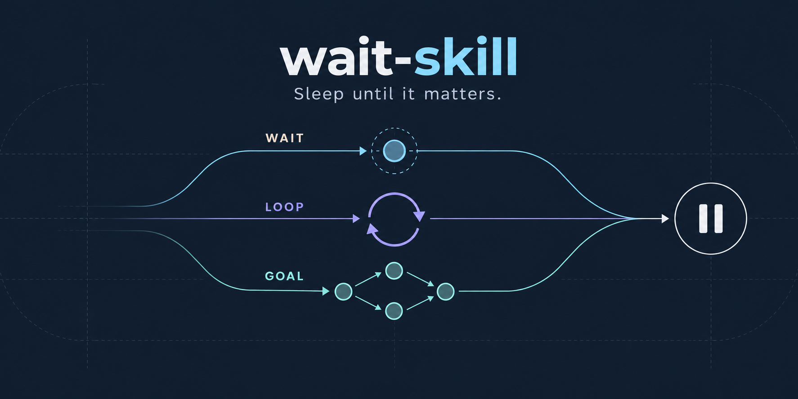

# wait-skill



[English](README.md) | 简体中文

为 CodeWiz、Cursor、Claude Code、GitHub Copilot 和 Codex 提供事件驱动等待：

- `$wait`：被动等待一个外部状态，不占用模型轮次反复轮询。
- `$wait-loop`：通过有界计时器重复执行一个任务。
- `$wait-goal`：把目标拆成有依赖的任务，由根 Agent 安排工作并验收最终结果。

`wait` 是主 Skill，衍生的 `wait-loop` 和 `wait-goal` 会复用它的 watcher。

## 安装

把仓库以 `wait` 名称克隆到当前客户端的 Skill 目录，再把内层衍生 Skill 暴露为同级 Skill：

```bash
skill_dir="$HOME/.codex/skills" # 替换为当前客户端的 Skill 目录
git clone https://github.com/wenxueru/wait-skill.git "$skill_dir/wait"
ln -s "$skill_dir/wait/wait-goal" "$skill_dir/wait-goal"
ln -s "$skill_dir/wait/wait-loop" "$skill_dir/wait-loop"
```

仓库根目录注册 `wait`，`wait-loop/` 和 `wait-goal/` 注册衍生 Skill。安装后重启或重新加载客户端。通过 SkillHub 安装时，可由它选择客户端对应的目录。

## 如何选择

| 场景 | 使用 |
| --- | --- |
| 等待一次部署、CI、队列或服务状态变化 | `$wait` |
| 使用 `$wait-loop` 请求按有界周期重复执行一个任务 | `$wait-loop` |
| 使用 `$wait-goal` 请求通过持久依赖图执行并验收目标 | `$wait-goal` |
| 正在运行的 goal 进入外部等待 | `$wait-goal` 把该等待交给 `$wait` |

## `$wait`：被动等待外部状态

使用 `$wait` 描述等什么、何时停止：

```text
$wait 等待 deployment api 进入 Ready；如果进入 Failed 则停止。
```

Agent 准备等待程序。本地 `waitd` 服务负责运行程序、保存输出和退出码，并在退出、超时或中断时通过[客户端适配](docs/clients.zh-CN.md)、用自己生成的固定指令唤醒会话。结果意味着什么，由 Agent 判断。

按[运行示例](docs/wait.zh-CN.md)准备 `/tmp/wait_deploy.py` 后提交；日志和锁文件路径自动生成：

```bash
python src/waitctl.py start -- \
  --label "deployment api" \
  --event-note "复查部署状态；成功则检查健康，失败则报告原因" \
  --client codex \
  --session "$AGENT_SESSION_ID" \
  -- env PYTHONPATH="$PWD/src" python /tmp/wait_deploy.py
```

内层 `--` 后的程序直接运行，不隐式调用 shell。轮询、解析结果和停止条件由程序处理；服务设置有限的 `--timeout`，默认一小时。更长的等待应评估任务稳定性与触发条件的可靠性，并考虑用 `wait-loop` 定期检查健康状态和实际进展。

服务管理见 [docs/waitd.zh-CN.md](docs/waitd.zh-CN.md)，等待规则和安全要求见 [docs/wait.zh-CN.md](docs/wait.zh-CN.md)。`wait_for.py` 提供 `poll(query, evaluate)`，供 Agent 的等待脚本复用。

## `$wait-loop`：Loop 模式

```text
$wait-loop 每 10 分钟检查队列，并报告需要处理的变化。
```

第一轮立即执行，成功后安排下一轮；保存的 event ID 防止重复执行。循环需要设置总时长，也可以限制轮数。通过 `waitctl.py loop -- ...` 管理，详见[协议和示例](docs/wait-loop.zh-CN.md)。

## `$wait-goal`：Goal 模式

```text
$wait-goal 发布 API，仅在测试和健康检查均通过后结束。
```

根 Agent 保存任务依赖图，并行安排独立工作，逐项验收结果；子 Agent 只向根 Agent 汇报。外部等待交给 `$wait`。结束轮次前，要么确认谁会唤醒自己，要么说明确实无法继续的原因。任务都做完后，还要检查用户的原始目标是否达成。

通过 `waitctl.py goal -- ...` 管理依赖图。服务负责保存和校验，根 Agent 决定如何调度。状态默认保存在 `/tmp/.wait-goal/<项目名>-<路径哈希>/`；需要其他位置时使用 `--state`。

完整的状态模型、依赖图规则、恢复流程和 CLI 参数见 [docs/wait-goal.zh-CN.md](docs/wait-goal.zh-CN.md)。

## 安全模型

- 等待程序应当是只读的。
- 将凭据放在环境变量或配置文件中，不要放入命令行参数。
- 程序的标准输出和标准错误各保存最多 64 KiB；输出不得含凭据。唤醒指令只引用日志，不自动拼入原始输出。
- `$wait` 会在通知前持久化 event ID 和投递状态；有限次数的重试复用同一 ID，因此可以安全去重重复唤醒。
- `event_note` 由提交等待的 Agent 简短描述下一步，不得包含凭据或外部输出；它只恢复上下文，不授权重新启动或修改被监视的系统。
- `$wait-goal` 的依赖图必须保持无环，并且只有根 Agent 可以修改。

## 相关工作

`$wait-goal` 是独立实现，没有复制以下项目的代码。这里只记录直接影响实现的工作：

| 工作 | 相关思想 | 与 `$wait-goal` 的关系 |
| --- | --- | --- |
| [MACU](https://arxiv.org/abs/2606.01533)（[代码](https://github.com/kohjingyu/multi-agent-computer-use)） | Manager 构造和修改 DAG，并行派发 ready frontier，同时记录图快照和重新规划事件。 | 最接近的架构来源：中心调度、动态 DAG、受限 fan-out 和持久图历史。`$wait-goal` 还专门处理跨轮次休眠和外部事件唤醒。 |
| [DynTaskMAS](https://arxiv.org/abs/2503.07675) | 异步执行引擎释放依赖已完成的任务，并选择性传递上下文。 | 启发了 ready frontier 调度和依赖范围内的节点输入。`$wait-goal` 不允许子 Agent 直接共享上下文，所有信息仍经根 Agent 中转。 |
| [Atomic Task Graph](https://arxiv.org/abs/2607.01942) | 显式任务接口和图演化历史。 | 启发了节点输入/产物契约、只追加事件和重试记录保留。 |

## 开发

脚本只依赖 Python 标准库。

```bash
python -m unittest discover -s tests -v
python /path/to/skill-creator/scripts/quick_validate.py .
```

## 许可证

MIT
