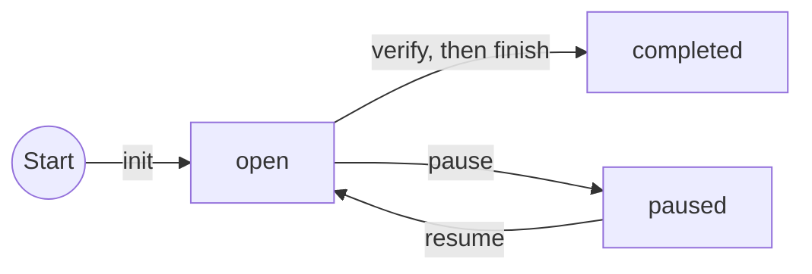
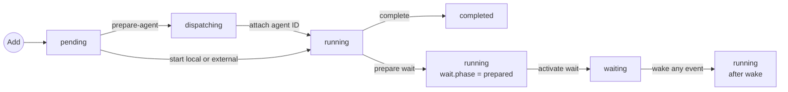
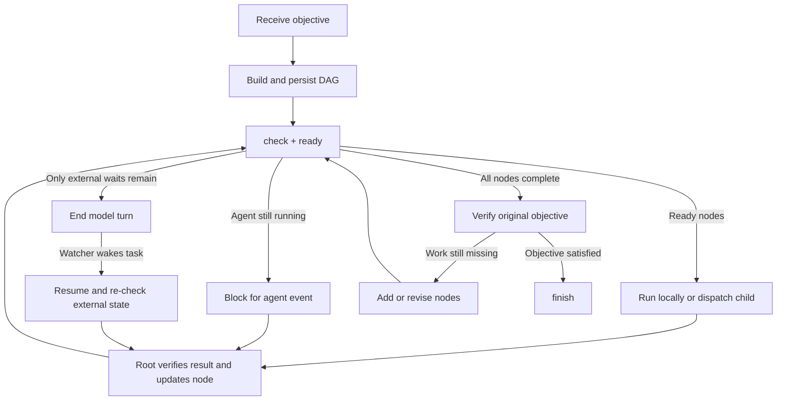

# `$wait-goal`: Durable, event-driven goals

English | [简体中文](wait-goal.zh-CN.md)

`wait-goal` turns an objective into a saved task dependency graph. The root assigns work and verifies results; external waits use `wait`. Before ending a turn, the root confirms a wake-up path or reports a genuine blocker.

## State model

`init` defaults to a unique JSON file under `/tmp/.wait-goal/<project-name>-<path-hash>/`. The nearest Git root identifies the project, so calls from its subdirectories share the same project directory; the path hash separates same-named checkouts. Retain the returned canonical `state_file` for later commands (`/tmp` may appear as `/private/tmp` on macOS). Pass `--state` only to override this location.

The persisted goal status is limited to `open`, `paused`, `completed`, and `cancelled`. `show` derives current activity from the nodes as `idle`, `ready`, `dispatching`, `running`, `waiting`, `orphaned_wait`, `blocked`, `awaiting_verification`, or `verified`. Nodes can be:

- `local`: local work performed sequentially by the root agent.
- `agent`: bounded work suitable for independent delegation.
- `external`: work that waits for CI, deployment, queue, or service state.

Node statuses are `pending`, `dispatching`, `running`, `waiting`, `completed`, `failed`, and `cancelled`. The `ready` command returns a pending node only after all dependencies are completed, excluding nodes whose declared or unknown write scope conflicts with an active or already selected node. Explicitly read-only nodes do not conflict. An unresolved `dispatching` node freezes the entire ready frontier until the root attaches the existing child or safely aborts the dispatch; this prevents duplicate children after an uncertain spawn result. Every successful mutation is appended atomically to the state's `events` history.

### Goal states



`cancel` moves an `open` or `paused` goal to `cancelled`. Both `completed` and `cancelled` are terminal.

### Node states



The diagram shows normal execution. Failures and control operations are listed below:

| Operation | Transition | Effect |
| --- | --- | --- |
| `fail` | `pending`, `running`, or `waiting` → `failed` | Record the failure summary and clear the wait |
| `retry` | `failed` → `pending` | Archive the failed attempt and schedule it again |
| `abort-agent` | `dispatching` → `pending` | Release a prepared dispatch only after confirming no child is live |
| `abort-wait` | prepared `running` or active `waiting` → `running` | Invalidate an orphaned watcher without recording a node failure |
| Cancel goal | `pending`, `dispatching`, `running`, or `waiting` → `cancelled` | Completed and failed nodes retain their status; a prepared dispatch retains its token for child reconciliation |

`prepared` and `resumed` make the wait path linear in the diagram; both persist as `running`. After a wake, the root may complete, fail, or prepare another wait. Only `external` nodes can enter `waiting`, and a node must be `running` before it can be completed.

## Execution overview



## Execution protocol

The root alone schedules work and mutates the graph. Child agents are isolated: they return summaries, acceptance evidence, artifacts, changed files, and discovered work only to the root; they do not contact or wait on each other, edit the graph, or create agents.

Run without assuming the user is present: avoid proactive questions and interactive question tools. Resolve reversible choices within the task and authorization using reasonable defaults; children report uncertainty to the root.

Every start or resume follows the same loop:

1. `show` loads and validates state, `check` reports scheduling issues, and `ready` returns the executable frontier. Rebuild the task's Todo from this state using node IDs; include final objective verification and follow the [client progress-tool rules](clients.md#progress-tools).
2. Start `local` and `external` nodes before acting. For an `agent` node, run `prepare-agent` first, include its stable dispatch token in the child task, dispatch the child, then attach its runtime ID using `start --dispatch-token ... --agent-id ...`. Update Todo after a successful start. Include agent-local step tracking and root reporting in child assignments; a shared list is maintained by the root.
3. The root verifies the result, then runs `complete` or `fail`. Add discovered work with `add --reason`. Synchronize affected Todo items after these commands succeed; child checklists alone do not complete DAG nodes.
4. If essential input or authorization is missing, preserve unfinished state, record the blocker in Todo, and continue independent authorized work. If that missing decision prevents further progress, report the blocker and state-file path and end the turn for later user-directed recovery. For execution waits with no ready node, use the derived activity:

| Activity | Action |
| --- | --- |
| `dispatching` | Reconcile the saved dispatch token with runtime agents; attach the existing child or, only after proving none is live, run `abort-agent` |
| `running` | Activate a prepared external wait, or block for an agent event |
| `waiting` | The watcher owns the wait; end the model turn |
| `orphaned_wait` | Run `check`, then recover the same node with its current watch ID; do not leave it suspended or replace it with a detached node |
| `blocked` | Report the blocking dependency and required decision; do not retry external work implicitly |
| `awaiting_verification` | Check the original objective; add missing work or run `verify` |
| `verified` | Run `finish` |

A node should be a bounded, independently verifiable unit. Merge work that shares substantial context, writes the same paths, or requires frequent coordination; `ready` defers write-conflicting nodes to a later frontier.

Mutation commands run under the state-file lock: load, validate, mutate, append an event, then atomically replace the file. Failed commands persist nothing, and an exact duplicate `wake` does not update `updated_at`. `events` is an audit trail; validated current state remains authoritative during recovery.

## Start a goal

After persisting the example graph, create `[test] Run tests`, `[deploy] Wait for deployment readiness`, and `Verify objective` in the native Todo tool, if available. Keep the verification item unfinished until `verify` and `finish` both succeed.

```bash
python src/waitctl.py goal -- init \
  --objective "Ship the API and finish after the health check passes" \
  --client codex \
  --session "$AGENT_SESSION_ID"

# Set this to the state_file returned by init.
GOAL_STATE=/tmp/.wait-goal/PROJECT/GOAL.json

python src/waitctl.py goal -- add \
  --state "$GOAL_STATE" \
  --id test \
  --title "Run tests" \
  --kind local \
  --write-path tests \
  --acceptance "The test suite passes" \
  --expects-artifact test-report

python src/waitctl.py goal -- add \
  --state "$GOAL_STATE" \
  --id deploy \
  --title "Wait for deployment readiness" \
  --kind external \
  --read-only \
  --depends-on test \
  --input test-result=test \
  --acceptance "Deployment status is Ready"
```

Retain the returned `state_file` as `GOAL_STATE` for every later command. `--input NAME=DEPENDENCY_ID` declares which direct dependency supplies an input. Dependencies must be added before the nodes that depend on them. Declare each node's workspace access with `--read-only` or one or more `--write-path` options. An omitted write scope is treated as unknown and serialized against other work. Path conflict checks are conservatively case-insensitive. List currently actionable, mutually write-safe nodes with:

```bash
python src/waitctl.py goal -- ready --state "$GOAL_STATE"
```

Use `check` to find graph and scheduling problems, and `events` to inspect operation history:

```bash
python src/waitctl.py goal -- check --state "$GOAL_STATE"
python src/waitctl.py goal -- events --state "$GOAL_STATE"
```

## Execute and evolve the DAG

Mark a node as running before executing it:

```bash
python src/waitctl.py goal -- start --state "$GOAL_STATE" --id test
```

For an `agent` node, reserve the node before calling the runtime:

```bash
python src/waitctl.py goal -- prepare-agent \
  --state "$GOAL_STATE" \
  --id review
```

Include `DISPATCH_TOKEN_FROM_PREPARE` in the child task or deterministic task name. After dispatch returns, attach the runtime ID:

```bash
python src/waitctl.py goal -- start \
  --state "$GOAL_STATE" \
  --id review \
  --dispatch-token DISPATCH_TOKEN_FROM_PREPARE \
  --agent-id AGENT_ID_FROM_RUNTIME
```

If recovery finds a `dispatching` node, first search the runtime for that token and attach the existing child. Do not spawn another child. Only after confirming that no child was created, or after terminating it, release the reservation with `abort-agent --dispatch-token DISPATCH_TOKEN_FROM_PREPARE`.

Record the result after its acceptance criteria pass:

```bash
python src/waitctl.py goal -- complete \
  --state "$GOAL_STATE" \
  --id test \
  --summary "All tests passed" \
  --artifact test-report
```

Declare required artifacts when adding a node with repeated `--expects-artifact` options. `complete` rejects the node until every declared artifact is supplied with `--artifact`.

Save newly discovered work with `add`. To place it before an existing pending node, use `--before`:

```bash
python src/waitctl.py goal -- add \
  --state "$GOAL_STATE" \
  --id security-review \
  --title "Review release security" \
  --before deploy \
  --reason "Deployment requires a newly discovered security review"
```

## Wait without model polling

For running agents, use the runtime's blocking wait and confirm that completion or attention events return to the root. Do not end a turn merely because a child is still running.

When only external state remains, choose a bound using the [wait limits](wait.md#wait-limits). If a long wait needs periodic health and progress assessment, the root can use `wait-loop` for hourly read-only checks. Bind the monitor with `loop init --goal-state FILE --goal-node ID`; its saved task describes the checks and how to report results to the root. Goal responses list linked loops, and the service cancels the monitor when the goal or node ends.

Prepare the waiting program, then use the goal watcher protocol:

1. Run `wait` with the program attached — `waitctl.py goal -- wait --state ... --id ... --label ... --timeout ... -- <waiting program>`. One command prepares the node while it remains `running`, generates the watch ID and coordination paths, submits the watcher to the service, and verifies the startup receipt. Retain the returned `watch_id` and `log_file`; nothing is copied between commands.
2. Run `activate-wait` with the watch ID. The node becomes `waiting`, and the waiting program starts. Mark the corresponding Todo waiting with its condition and deadline.
3. Set up event delivery for the owning session through the [client adapter](clients.md). End the current model turn and stop querying that external state.
4. On completion, the service resumes with `$wait-goal resume {goal_state}; node={goal_node}; event_id={event_id}; log_file={log_file}`, generated from the paths bound at submission — nothing further to prepare.
5. On resume, read the output and exit code, run `wake` with the logged event (`exited`, `timeout`, `start_failed`, or `interrupted`), and recheck current external state. Every event returns the node to `running`; only the root's verified `complete`, `fail`, or next `wait` decision changes its outcome. IDs from older wait cycles are rejected and exact duplicates are no-ops. Update Todo after the root records its decision.

See [wait.md](wait.md) for the watcher protocol and [clients.md](clients.md) for resume adapters.

## Control and resume

On resume, refresh this goal's Todo from persisted state. After a successful control command, synchronize the affected items.

Show the full state:

```bash
python src/waitctl.py goal -- show --state "$GOAL_STATE"
```

Pause or resume scheduling:

```bash
python src/waitctl.py goal -- pause --state "$GOAL_STATE"
python src/waitctl.py goal -- resume --state "$GOAL_STATE"
```

Cancellation marks every nonterminal node as `cancelled`:

```bash
python src/waitctl.py goal -- cancel --state "$GOAL_STATE"
```

Pausing or cancelling scheduling does not forcibly terminate running agents or submitted external jobs. A goal-owned watcher observes a cancelled or replaced wait during ownership checks or before a notification retry and exits itself.

If a watcher fails before activation, exits without delivering an event, or must be replaced, invalidate that exact wait without failing the node:

```bash
python src/waitctl.py goal -- abort-wait \
  --state "$GOAL_STATE" \
  --id deploy \
  --watch-id CURRENT_WATCH_ID
```

The node returns to `running` and can prepare a new wait. The watch ID guard prevents a stale recovery command from cancelling a newer watcher. A still-running old watcher observes the invalidated ID and exits during ownership checks or before a notification retry.

`check` verifies that every `waiting` node still has a watcher holding its recorded lock. A missing owner is an `orphaned_wait` error, and `show` exposes `orphaned_wait` as the current activity. Recover the existing node with `abort-wait`; do not create a second node for the same external object.

After deciding that a failed node may be attempted again, archive the failed attempt and reset it to `pending`:

```bash
python src/waitctl.py goal -- retry --state "$GOAL_STATE" --id deploy
```

`retry` changes scheduler state only. It does not authorize or perform an external retry, deployment, restart, or other side effect.

When continuing the same logical external operation, retry the failed original node so its existing successors remain connected. Adding an unrelated replacement node does not repair dependencies blocked by the failed node.

## Finish a goal

After every node is complete, verify the result against the original request. If the request is not yet satisfied, add the missing work as nodes and continue. Otherwise persist the verification evidence before finishing:

```bash
python src/waitctl.py goal -- verify \
  --state "$GOAL_STATE" \
  --summary "The original request is satisfied" \
  --check "all tests passed" \
  --check "the health endpoint is Ready"
```

Then finish the goal:

```bash
python src/waitctl.py goal -- finish \
  --state "$GOAL_STATE" \
  --summary "Release completed; tests and health checks passed"
```

`verify` rejects an empty graph or any non-completed node. `finish` rejects a goal without persisted verification. Completed nodes and goals must retain a non-empty result and completion timestamp. The state file retains the verification evidence and is not deleted automatically.
