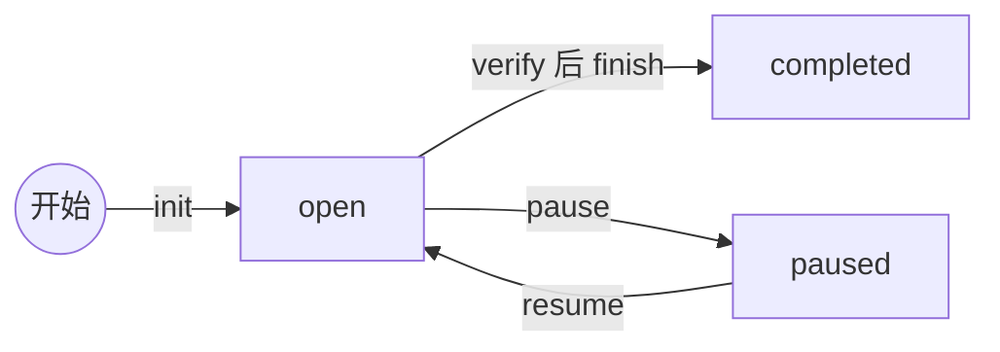
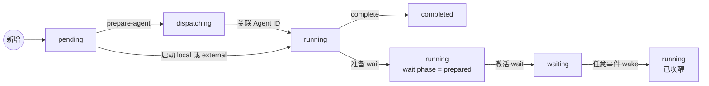
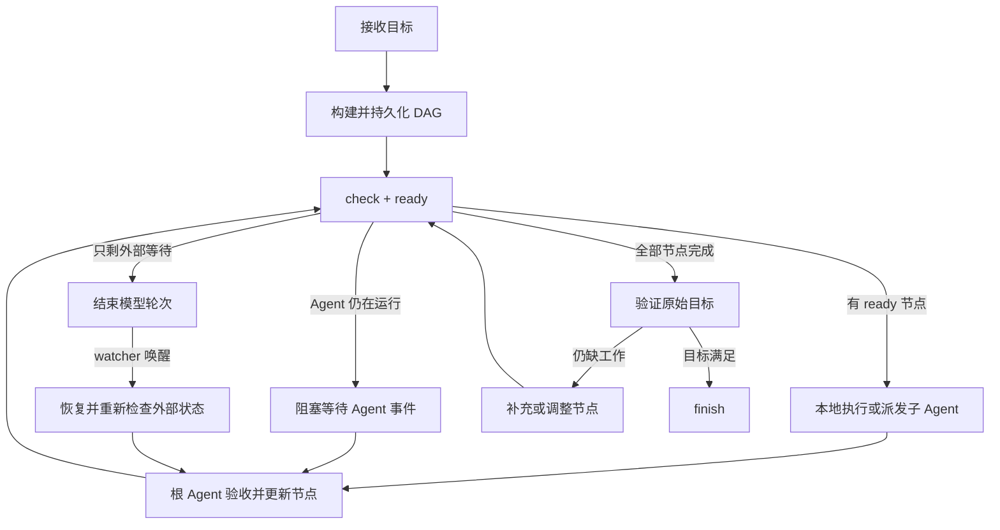

# `$wait-goal`：事件驱动的持久目标

[English](wait-goal.md) | 简体中文

`$wait-goal` 用于执行包含依赖步骤、并行 Agent 或长时间外部等待的目标。它不使用原生 `/goal`，也不依靠模型反复检查未变化的状态。没有可执行工作时，模型轮次结束；外部事件通过显式 `$wait-goal resume` 消息恢复任务。

## 状态模型

每个目标保存在一个 JSON 文件中，建议使用 `.wait-goal/<goal-id>.json`。该目录已被 `.gitignore` 排除，避免把运行时状态意外提交。

持久化的目标状态只有 `open`、`paused`、`completed` 和 `cancelled`。`show` 根据节点动态计算活动状态：`idle`、`ready`、`dispatching`、`running`、`waiting`、`blocked`、`awaiting_verification` 或 `verified`。节点可以是：

- `local`：由根 Agent 顺序完成的本地工作。
- `agent`：适合独立委派的有界工作。
- `external`：需要等待 CI、部署、队列或服务状态的工作。

节点状态为 `pending`、`dispatching`、`running`、`waiting`、`completed`、`failed` 或 `cancelled`。只有所有依赖均为 `completed` 的 `pending` 节点才会由 `ready` 返回；与运行中节点或本批已选节点写入范围冲突的节点会被排除，未声明范围按未知写入处理，显式只读节点不冲突。存在未决的 `dispatching` 节点时，整个 ready frontier 都会冻结，直到根 Agent 关联已有子 Agent 或安全撤销本次派发，以避免派发结果不确定时创建重复子 Agent。每次成功修改都会原子追加到状态文件的 `events` 历史。

### 目标状态



在 `open` 或 `paused` 状态执行 `cancel`，目标进入 `cancelled`。`completed` 和 `cancelled` 都是终态。

### 节点状态



图只展示正常执行和外部等待流程；异常与控制转换单独列出，避免交叉线：

| 操作 | 转换 | 说明 |
| --- | --- | --- |
| `fail` | `pending`、`running` 或 `waiting` → `failed` | 记录失败摘要并清除 wait |
| `retry` | `failed` → `pending` | 归档本次失败后重新调度 |
| `abort-agent` | `dispatching` → `pending` | 只有确认没有存活子 Agent 后才释放派发预留 |
| `abort-wait` | prepared `running` 或 active `waiting` → `running` | 使孤儿 watcher 失效，但不把节点记录为失败 |
| `cancel` 目标 | `pending`、`dispatching`、`running` 或 `waiting` → `cancelled` | 已完成和已失败节点保持原状态；prepared dispatch 保留 token 以便核对子 Agent |

`prepared` 和 `resumed` 只是为了把等待过程画成直线；两者的持久化节点状态都是 `running`。唤醒后，根 Agent 可以 `complete`、`fail` 或准备下一轮 wait。只有 `external` 节点可以进入 `waiting`；节点必须处于 `running` 才能执行 `complete`。

## 运行流程总览



根 Agent 始终是唯一调度中心。子 Agent 和 watcher 只返回事件或结果，不直接修改依赖图。

## 执行协议

根 Agent 独占调度和图修改权限。子 Agent 彼此隔离，只向根 Agent 返回节点摘要、验收证据、产物、变更文件和新发现工作；不得相互通信、等待、改图或创建 Agent。

每次启动或恢复都执行相同循环：

1. `show` 加载并验证状态，`check` 输出调度诊断，`ready` 返回本轮可执行节点。
2. `local`、`external` 节点先 `start` 再执行。对于 `agent` 节点，先执行 `prepare-agent`，把稳定的 dispatch token 写入子任务，派发后再使用 `start --dispatch-token ... --agent-id ...` 关联运行时 ID。
3. 根 Agent 验收结果后执行 `complete` 或 `fail`；新工作使用 `add --reason` 入图。
4. 没有 ready 节点时，根据活动状态决定下一步：

| 活动状态 | 动作 |
| --- | --- |
| `dispatching` | 使用保存的 dispatch token 对照运行时 Agent；关联已有子 Agent，或仅在确认没有存活实例后执行 `abort-agent` |
| `running` | 激活已准备的 external wait，或阻塞等待 Agent 事件 |
| `waiting` | watcher 已接管，结束当前模型轮次 |
| `blocked` | 报告阻断依赖和所需决定，不自行重试外部操作 |
| `awaiting_verification` | 对照原始目标；缺工作则加节点，否则 `verify` |
| `verified` | `finish` |

节点应是可独立验收的有界工作单元。共享大量上下文、写同一路径或需要频繁协调的工作应合并；`ready` 会把有写入冲突的节点留到下一轮。

所有修改命令都在状态文件锁内执行“加载 → 验证 → 修改 → 追加事件 → 原子替换”。命令失败时不保存状态或事件；完全重复的 `wake` 不修改 `updated_at`。`events` 是审计记录，不替代当前状态，恢复时仍以通过验证的状态文件为准。

## 开始目标

```bash
python scripts/wait_goal.py init \
  --state .wait-goal/release.json \
  --objective "发布 API，并在健康检查通过后结束" \
  --thread "$CODEX_THREAD_ID"

python scripts/wait_goal.py add \
  --state .wait-goal/release.json \
  --id test \
  --title "运行测试" \
  --kind local \
  --write-path tests \
  --acceptance "测试套件通过" \
  --expects-artifact test-report

python scripts/wait_goal.py add \
  --state .wait-goal/release.json \
  --id deploy \
  --title "等待部署就绪" \
  --kind external \
  --read-only \
  --depends-on test \
  --input test-result=test \
  --acceptance "部署状态为 Ready"
```

`--input 名称=依赖节点ID` 声明输入由哪个直接依赖提供。依赖必须先于依赖它的节点加入。每个节点应使用 `--read-only` 或一个以上 `--write-path` 明确工作区访问范围；未声明的写入范围按未知处理，会与其他任务串行，路径冲突采用保守的大小写不敏感比较。运行以下命令获取当前可执行且写入互不冲突的节点：

```bash
python scripts/wait_goal.py ready --state .wait-goal/release.json
```

使用 `check` 查看确定性的依赖图和调度诊断，使用 `events` 查看只追加的操作历史：

```bash
python scripts/wait_goal.py check --state .wait-goal/release.json
python scripts/wait_goal.py events --state .wait-goal/release.json
```

## 执行与演化 DAG

执行节点前先标记为运行：

```bash
python scripts/wait_goal.py start --state .wait-goal/release.json --id test
```

对于 `agent` 节点，调用运行时前先预留节点：

```bash
python scripts/wait_goal.py prepare-agent \
  --state .wait-goal/release.json \
  --id review
```

把 `DISPATCH_TOKEN_FROM_PREPARE` 写入子任务或确定性的任务名。派发返回后关联运行时 ID：

```bash
python scripts/wait_goal.py start \
  --state .wait-goal/release.json \
  --id review \
  --dispatch-token DISPATCH_TOKEN_FROM_PREPARE \
  --agent-id AGENT_ID_FROM_RUNTIME
```

恢复时如果发现 `dispatching` 节点，先在运行时中查找该 token 并关联已有子 Agent，不得重新派发。只有确认子 Agent 未被创建，或已经终止它之后，才能执行 `abort-agent --dispatch-token DISPATCH_TOKEN_FROM_PREPARE` 释放预留。

验收条件通过后记录结果：

```bash
python scripts/wait_goal.py complete \
  --state .wait-goal/release.json \
  --id test \
  --summary "全部测试通过" \
  --artifact test-report
```

添加节点时可重复使用 `--expects-artifact` 声明必需产物。只有通过 `--artifact` 提供全部必需产物后，`complete` 才会成功。

执行过程中发现的新工作应使用 `add` 写入 DAG，而不是只保留在对话上下文中。

如果新工作必须在某个现有 `pending` 节点之前完成，可以使用 `--before` 插入：

```bash
python scripts/wait_goal.py add \
  --state .wait-goal/release.json \
  --id security-review \
  --title "执行发布安全检查" \
  --before deploy \
  --reason "执行中发现部署前还需要安全检查"
```

## 等待而不消耗模型轮询

如果 Agent 仍在运行，根 Agent 使用运行时提供的阻塞等待，只在完成或需要关注时恢复。

如果只剩外部状态：

1. 运行 `wait` 准备元数据，节点暂时保持 `running`；保存唯一 `watch_id` 和命令返回的绝对路径。state、log、lock 和 startup 路径必须互不相同。
2. 使用这些路径、watch ID 和 `--goal-node` 启动 `wait_for.py`。它先取得 watcher lock、写入启动回执，然后在不查询外部系统的情况下等待激活。
3. 确认启动回执后运行 `activate-wait`。节点进入 `waiting`，watcher 才开始查询。
4. 结束当前模型轮次，不再查询该外部状态。
5. watcher 在出现事件时发送 `$wait-goal resume <state-file>`。
6. 恢复后读取日志、执行 `wake`，再重新查询一次外部状态。所有事件都先让节点回到 `running`；只有根 Agent 验证后执行的 `complete`、`fail` 或下一轮 `wait` 才决定结果。旧等待 ID 会被拒绝，同一事件重复到达时为空操作。

完整 watcher 参数和消息模板见 [wait.zh-CN.md](wait.zh-CN.md)。

## 控制和恢复

查看完整状态：

```bash
python scripts/wait_goal.py show --state .wait-goal/release.json
```

暂停或恢复调度：

```bash
python scripts/wait_goal.py pause --state .wait-goal/release.json
python scripts/wait_goal.py resume --state .wait-goal/release.json
```

取消会把尚未完成的节点标记为 `cancelled`：

```bash
python scripts/wait_goal.py cancel --state .wait-goal/release.json
```

暂停或取消调度不会强制终止正在运行的 Agent 或已经提交的外部作业。goal 自己启动的 watcher 会在下一次查询或通知重试前发现 wait 已取消或替换，并自行退出。

如果 watcher 在激活前失败、没有投递事件便退出，或必须被替换，可以在不判定节点失败的情况下使本轮 wait 失效：

```bash
python scripts/wait_goal.py abort-wait \
  --state .wait-goal/release.json \
  --id deploy \
  --watch-id CURRENT_WATCH_ID
```

节点会回到 `running`，随后可以准备新的 wait。watch ID 校验可以防止旧恢复命令误伤更新的 watcher；仍存活的旧 watcher 会在下一次查询或通知重试前发现 ID 已失效并退出。

确认失败节点允许再次尝试后，可归档失败记录并将它恢复为 `pending`：

```bash
python scripts/wait_goal.py retry --state .wait-goal/release.json --id deploy
```

`retry` 只修改调度状态，不会授权或执行外部重试、部署、重启等副作用。

## 完成目标

所有节点都完成后，再对照原始需求运行 objective 级别的最终验证。如果需求仍未满足，应把缺失工作新增为节点并继续执行。验证通过后，先持久化验收证据：

```bash
python scripts/wait_goal.py verify \
  --state .wait-goal/release.json \
  --summary "原始需求已经满足" \
  --check "全部测试通过" \
  --check "健康检查状态为 Ready"
```

然后结束目标：

```bash
python scripts/wait_goal.py finish \
  --state .wait-goal/release.json \
  --summary "发布完成，测试与健康检查均通过"
```

`verify` 会拒绝空图或任何未完成节点，`finish` 会拒绝没有持久化验收记录的目标。已完成节点和目标必须保留非空结果与完成时间。状态文件会保留验收证据，不应在完成时自动删除。
