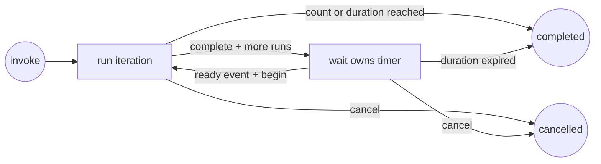

# `wait-loop`: Event-driven Loop mode

English | [简体中文](wait-loop.zh-CN.md)

`wait-loop` implements an explicitly invoked Loop mode. The root session executes one iteration at a time; the parent `wait` watcher handles only the timer between iterations, so unchanged time does not consume model turns.

## Lifecycle



The first iteration runs immediately. A successful `complete` either finishes the loop or creates exactly one `watch_id` for the next timer. `begin` consumes that ID before the next iteration, making duplicate wake-ups no-ops.

## Running example

Run a queue check every ten minutes, at most four times and for no longer than one hour:

```bash
python scripts/wait_loop.py init \
  --task "Inspect the queue and report actionable changes" \
  --interval 600 \
  --duration 3600 \
  --max-iterations 4 \
  --client codex \
  --session "$AGENT_SESSION_ID"

# Set this from init output.
LOOP_STATE=/tmp/.wait-loop/PROJECT/LOOP.json

# After performing iteration 1:
python scripts/wait_loop.py complete \
  --state "$LOOP_STATE" \
  --summary "Queue inspected; no actionable change"

# Set this from complete output.
WATCH_ID=WATCH_ID_FROM_COMPLETE

python scripts/wait_for.py \
  --label "queue inspection timer" \
  --ready Ready \
  --terminal Expired \
  --interval 600 \
  --timeout 3700 \
  --client codex \
  --session "$AGENT_SESSION_ID" \
  --event-id "$WATCH_ID" \
  --loop-state "$LOOP_STATE" \
  --lock-file /tmp/wait-loop-queue.lock \
  --log-file /tmp/wait-loop-queue.json \
  --message-template "\$wait-loop resume $LOOP_STATE; watcher_log=/tmp/wait-loop-queue.json; event_id={event_id}; event={event}; status={status}" \
  -- python scripts/wait_loop.py due --state "$LOOP_STATE" --watch-id "$WATCH_ID"
```

When the watcher reports `ready`, validate its log and consume the event before executing the task:

```bash
python scripts/wait_loop.py begin \
  --state "$LOOP_STATE" \
  --event-id "$WATCH_ID"
```

If `begin` returns `duplicate: true`, do not run the iteration again. If its returned status is `completed`, the ready event crossed the loop deadline; stop without running another iteration. Otherwise execute the saved task once and call `complete` again. When the watcher reports `Expired`, run:

```bash
python scripts/wait_loop.py expire \
  --state "$LOOP_STATE" \
  --event-id "$WATCH_ID"
```

## State and limits

Without `--state`, `init` creates `/tmp/.wait-loop/<project-name>-<path-hash>/loop-<id>.json` and returns its canonical path. The closest Git root identifies the project. On macOS, the returned path may use `/private/tmp`.

The state records the task, client, session, interval, deadline, optional iteration limit, current phase, active watch ID, completed run summaries, and event history. The loop has two independent bounds:

- `--duration` limits the complete loop and defaults to 24 hours.
- `--max-iterations` optionally limits successful iterations.

Each `wait_for.py` timer also requires its own finite `--timeout`. Set it no later than the loop deadline plus a small delivery margin.

## Recovery and cancellation

- `show --state FILE` reads current state.
- `cancel --state FILE` prevents future iterations. Ownership validation stops its active timer before the next query or notification retry.
- If an iteration fails or is interrupted, leave it in `running`; do not call `complete`. Report the failure and ask whether to retry the task or cancel the loop.
- If watcher ownership is lost, re-read state. Do not create another watcher until confirming which `watch_id` is active.

Timer events do not grant authority for external mutations performed by the repeated task. Re-check current state and existing authorization on every iteration.
