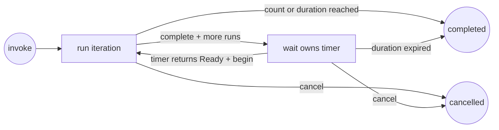

# `wait-loop`: Event-driven Loop mode

English | [简体中文](wait-loop.zh-CN.md)

The root runs the task once, then `wait` handles the timer until the next run. Only one iteration runs at a time; the model stays idle between runs.

## Lifecycle



The first iteration runs immediately. A successful `complete` either finishes the loop or creates exactly one `watch_id` for the next timer. `begin` consumes that ID before the next iteration, making duplicate wake-ups no-ops.

The user may be away during any iteration. Avoid proactive questions and interactive question tools; use reasonable defaults for reversible choices within the saved task and authorization.

## Running example

Run a queue check every ten minutes, at most four times and for no longer than one hour:

```bash
python src/waitctl.py loop -- init \
  --task "Inspect the queue and report actionable changes" \
  --interval 600 \
  --duration 3600 \
  --max-iterations 4 \
  --client codex \
  --session "$AGENT_SESSION_ID"

# Set this from init output.
LOOP_STATE=/tmp/.wait-loop/PROJECT/LOOP.json

# After performing iteration 1:
python src/waitctl.py loop -- complete \
  --state "$LOOP_STATE" \
  --summary "Queue inspected; no actionable change"

# Set this from complete output.
WATCH_ID=WATCH_ID_FROM_COMPLETE

# complete has registered the next timer through the service.
```

After each timer registration, set up event delivery using the saved watch ID and the [client adapter](clients.md), then end the turn.

On each timer, the service resumes with `$wait-loop resume {state_file}; event_id={event_id}; log_file={log_file}`, generated from the loop's own state path — nothing to prepare at initialization. When the log reports `event: exited`, `exit_code: 0`, and stdout `Ready`, consume the event before executing the task:

```bash
python src/waitctl.py loop -- begin \
  --state "$LOOP_STATE" \
  --event-id "$WATCH_ID"
```

After `begin`, skip duplicate events and stop if the returned status is `completed` (the deadline has passed). Otherwise run the task once and call `complete`. If the timer's stdout is `Expired`, run:

```bash
python src/waitctl.py loop -- expire \
  --state "$LOOP_STATE" \
  --event-id "$WATCH_ID"
```

## State and limits

Without `--state`, `init` creates `/tmp/.wait-loop/<project-name>-<path-hash>/loop-<id>.json` and returns its canonical path. The closest Git root identifies the project. On macOS, the returned path may use `/private/tmp`.

Use `waitctl loop` to manage the loop through `waitd`; `wait_loop.py` also works as a standalone state engine. The saved file survives service restarts and records the task, client/session, schedule, phase, watch ID, run summaries, and event history. Two limits control when the loop stops:

- `--duration` limits the complete loop and defaults to 24 hours.
- `--max-iterations` optionally limits successful iterations.

The service registers each timer after `complete`, with a deadline of `next_run_at` plus 60 seconds. The program is `wait_loop.py due --wait`; it blocks until the saved timer is due or expired. It records the loop path before running state commands, so restart can repair a missing timer without repeating an iteration. Timer logs are stored beside the loop state, named with its watch ID.

## Recovery and cancellation

- `show --state FILE` reads current state.
- `cancel --state FILE` prevents future iterations. Ownership validation stops its active timer during execution or before a notification retry.
- If an iteration fails, is interrupted, or lacks essential input or authorization, leave it in `running`; do not call `complete` or silently retry. Report the blocker and state-file path, then end the turn. No next timer is scheduled; resume the unfinished iteration when the user later provides direction.
- Run `waitctl loop -- show --state FILE` to reconcile timer registration. A missing registry entry is recreated with the saved watch ID. An interrupted program is not replayed. For `timeout`, `start_failed`, `interrupted`, or a delivery failure, inspect `waitctl show WATCH_ID` and its log before resuming. Read `due --state FILE --watch-id ID` once to verify the timer; call `begin` only for `Ready`, or `expire` for `Expired`.
- For a Goal monitor, pass `--goal-state FILE --goal-node ID` to `init`. The service reports these links in goal responses and cancels the monitor when its goal is no longer open or its node finishes. Timer ownership and `begin` also check the link.

Timer events do not grant authority for external mutations performed by the repeated task. Re-check current state and existing authorization on every iteration.
