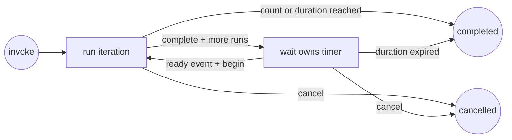

# `wait-loop`: Event-driven Loop mode

English | [简体中文](wait-loop.zh-CN.md)

The root session executes one iteration at a time; the parent `wait` watcher handles only the timer between iterations, so unchanged time does not consume model turns.

## Lifecycle



The first iteration runs immediately. A successful `complete` either finishes the loop or creates exactly one `watch_id` for the next timer. `begin` consumes that ID before the next iteration, making duplicate wake-ups no-ops.

## Running example

Run a queue check every ten minutes, at most four times and for no longer than one hour:

```bash
python scripts/waitctl.py loop -- init \
  --task "Inspect the queue and report actionable changes" \
  --interval 600 \
  --duration 3600 \
  --max-iterations 4 \
  --client codex \
  --session "$AGENT_SESSION_ID"

# Set this from init output.
LOOP_STATE=/tmp/.wait-loop/PROJECT/LOOP.json

# After performing iteration 1:
python scripts/waitctl.py loop -- complete \
  --state "$LOOP_STATE" \
  --summary "Queue inspected; no actionable change"

# Set this from complete output.
WATCH_ID=WATCH_ID_FROM_COMPLETE

# complete has registered the next timer through the service.
```

After each timer registration, set up event delivery using the saved watch ID and the [client adapter](clients.md), then end the turn.

When the watcher reports `ready`, validate its log and consume the event before executing the task:

```bash
python scripts/waitctl.py loop -- begin \
  --state "$LOOP_STATE" \
  --event-id "$WATCH_ID"
```

If `begin` returns `duplicate: true`, do not run the iteration again. If its returned status is `completed`, the ready event crossed the loop deadline; stop without running another iteration. Otherwise execute the saved task once and call `complete` again. When the watcher reports `Expired`, run:

```bash
python scripts/waitctl.py loop -- expire \
  --state "$LOOP_STATE" \
  --event-id "$WATCH_ID"
```

## State and limits

Without `--state`, `init` creates `/tmp/.wait-loop/<project-name>-<path-hash>/loop-<id>.json` and returns its canonical path. The closest Git root identifies the project. On macOS, the returned path may use `/private/tmp`.

All loop state commands go through `waitctl` and the local `waitd` service. `wait_loop.py` remains the isolated state engine and compatibility entry point; its durable file remains authoritative across service restarts. The state records the task, client, session, interval, deadline, optional iteration limit, current phase, active watch ID, completed run summaries, and event history. The loop has two independent bounds:

- `--duration` limits the complete loop and defaults to 24 hours.
- `--max-iterations` optionally limits successful iterations.

The service registers each timer after `complete`, with a deadline bounded by the loop deadline plus 60 seconds. It records the loop path before running state commands, so restart can repair a missing timer without repeating an iteration. Timer logs are stored beside the loop state, named with its watch ID.

## Recovery and cancellation

- `show --state FILE` reads current state.
- `cancel --state FILE` prevents future iterations. Ownership validation stops its active timer before the next query or notification retry.
- If an iteration fails or is interrupted, leave it in `running`; do not call `complete`. Report the failure and ask whether to retry the task or cancel the loop.
- Run `waitctl loop -- show --state FILE` to reconcile timer registration. A missing registry entry is recreated with the saved watch ID. A recorded delivery failure requires inspection of `waitctl show WATCH_ID` and its log before manual resume.
- For a Goal monitor, pass `--goal-state FILE --goal-node ID` to `init`. The service reports these links in goal responses and cancels the monitor when its goal is no longer open or its node finishes. Timer ownership and `begin` also check the link.

Timer events do not grant authority for external mutations performed by the repeated task. Re-check current state and existing authorization on every iteration.
