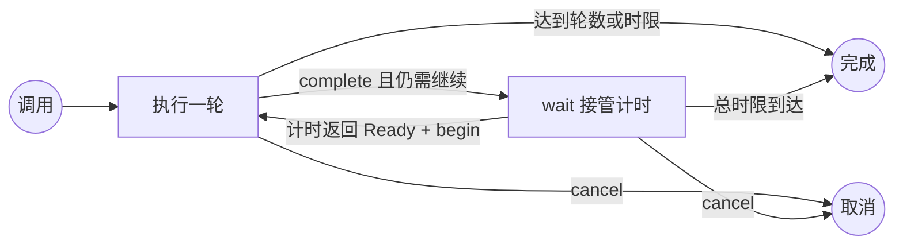

# `wait-loop`：事件驱动 Loop 模式

[English](wait-loop.md) | 简体中文

根 Agent 做完一轮任务，再由 `wait` 计时等待下一轮。同一时间只运行一轮，两轮之间模型不用轮询。

## 生命周期



第一轮立即执行。成功执行 `complete` 后，要么结束循环，要么只生成一个供下一次计时使用的 `watch_id`。下一轮执行前，`begin` 会先消费该 ID，因此重复唤醒不会重复执行任务。

每轮执行时，用户都可能不在场。避免主动提问和交互式提问工具；已保存任务与授权范围内的可逆选择采用合理默认值。

## 完整示例

每十分钟检查一次队列，最多四轮，并且总时长不超过一小时：

```bash
python src/waitctl.py loop -- init \
  --task "检查队列并报告需要处理的变化" \
  --event-note "读取计时日志，Ready 则开始下一轮，Expired 则结束" \
  --interval 600 \
  --duration 3600 \
  --max-iterations 4 \
  --client codex \
  --session "$AGENT_SESSION_ID" \
  --remote "unix:///path/to/app-server-control.sock"

# 设置为 init 返回的值。
LOOP_STATE=/tmp/.wait-loop/PROJECT/LOOP.json

# 完成第一轮任务后：
python src/waitctl.py loop -- complete \
  --state "$LOOP_STATE" \
  --summary "已检查队列，没有需要处理的变化"

# 设置为 complete 返回的值。
WATCH_ID=WATCH_ID_FROM_COMPLETE

# complete 已由服务注册下一轮计时器。
```

每次注册计时器后，使用保存的 watch ID，按[客户端适配](clients.zh-CN.md)接好事件投递通道，再结束轮次。

每次计时结束，服务用 `$wait-loop resume {state_file}; event_id={event_id}; log_file={log_file}; event_note="{event_note}"` 唤醒。状态路径由 loop 生成，简短的 note 由 Agent 初始化 loop 时写入。日志报告 `event: exited`、`exit_code: 0`，且 stdout 为 `Ready` 时，先记录本次唤醒，再执行任务：

```bash
python src/waitctl.py loop -- begin \
  --state "$LOOP_STATE" \
  --event-id "$WATCH_ID"
```

`begin` 返回 `duplicate: true` 时跳过重复事件；返回 `completed` 时说明已过截止时间，直接停止。其他情况执行一轮任务，再调用 `complete`。计时程序的 stdout 为 `Expired` 时运行：

```bash
python src/waitctl.py loop -- expire \
  --state "$LOOP_STATE" \
  --event-id "$WATCH_ID"
```

## 状态与上限

不传 `--state` 时，`init` 会创建 `/tmp/.wait-loop/<项目名>-<路径哈希>/loop-<ID>.json` 并返回规范化路径。最近的 Git 根目录用于识别项目；macOS 返回值可能使用 `/private/tmp`。

用 `waitctl loop` 通过 `waitd` 管理循环；`wait_loop.py` 也可独立处理状态。状态文件在服务重启后仍有效，记录任务、客户端与会话、远程端点、时间安排、阶段、watch ID、执行摘要和操作历史。投递和停止条件都在 `init` 时确定：

- `--duration` 限制整个循环，默认 24 小时。
- `--max-iterations` 可选，用于限制成功完成的轮数。
- `--remote` 可选，只用于 Codex；显式值会传给之后的每个计时 watcher，省略时使用默认 app-server 控制 socket。

服务在 `complete` 后注册 `wait_loop.py due --wait`，截止时间为 `next_run_at` 加 60 秒。Loop 状态会在注册前保存路径和远程端点，因此服务重启后可以补齐遗漏的计时器而不重复本轮任务。每个计时器都执行与普通 wait 相同的通知预检；日志保存在 loop 状态文件旁，并以 watch ID 命名。

## 恢复与取消

- `show --state FILE`：读取当前状态。
- `cancel --state FILE`：阻止后续迭代；所有权校验会在执行期间或通知重试前停止活动计时器。
- 本轮失败、中断或缺少关键输入、授权时，保持 `running`，不调用 `complete` 或静默重试。报告阻塞原因与状态文件路径，然后结束轮次。此时不会安排下一计时器；用户之后给出方向时恢复未完成的迭代。
- 运行 `waitctl loop -- show --state FILE` 核对计时器注册。服务会用已保存的 watch ID 补齐缺失的注册记录。已经启动但中断的程序不自动重跑。遇到 `timeout`、`start_failed`、`interrupted` 或投递失败时，先查看 `waitctl show WATCH_ID` 及日志，再恢复。可运行一次 `due --state FILE --watch-id ID` 复查计时；只有 `Ready` 才执行 `begin`，`Expired` 则执行 `expire`。
- Goal 监控在 `init` 时传入 `--goal-state FILE --goal-node ID`。服务在 goal 响应中列出关联，并在目标离开 open 状态或节点结束时取消监控。计时器所有权检查和 `begin` 也会检查该关联。

定时事件不会扩大重复任务执行外部修改的权限。每一轮都必须重新确认当前状态和已有授权。
