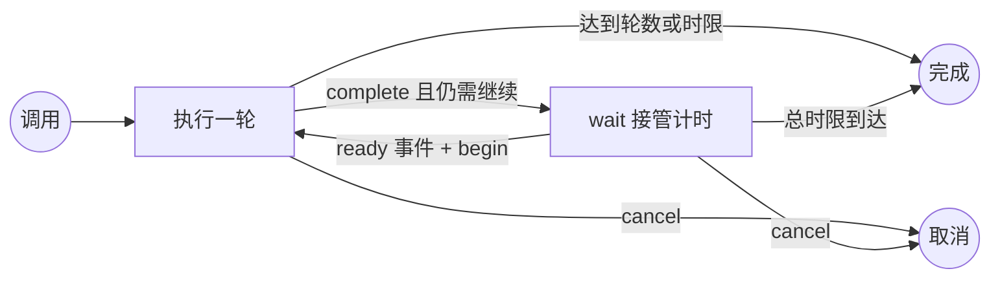

# `wait-loop`：事件驱动 Loop 模式

[English](wait-loop.md) | 简体中文

`wait-loop` 实现由用户明确调用的 Loop 模式。根会话每次只执行一轮；两轮之间仅由父级 `wait` watcher 负责计时，因此时间未到时不消耗模型轮次。

## 生命周期



第一轮立即执行。成功执行 `complete` 后，要么结束循环，要么只生成一个供下一次计时使用的 `watch_id`。下一轮执行前，`begin` 会先消费该 ID，因此重复唤醒不会重复执行任务。

## 完整示例

每十分钟检查一次队列，最多四轮，并且总时长不超过一小时：

```bash
python scripts/wait_loop.py init \
  --task "检查队列并报告需要处理的变化" \
  --interval 600 \
  --duration 3600 \
  --max-iterations 4 \
  --client codex \
  --session "$AGENT_SESSION_ID"

# 设置为 init 返回的值。
LOOP_STATE=/tmp/.wait-loop/PROJECT/LOOP.json

# 完成第一轮任务后：
python scripts/wait_loop.py complete \
  --state "$LOOP_STATE" \
  --summary "已检查队列，没有需要处理的变化"

# 设置为 complete 返回的值。
WATCH_ID=WATCH_ID_FROM_COMPLETE

python scripts/wait_for.py \
  --label "队列检查计时器" \
  --ready Ready \
  --terminal Expired \
  --interval 600 \
  --timeout 3700 \
  --client codex \
  --session "$AGENT_SESSION_ID" \
  --event-id "$WATCH_ID" \
  --loop-state "$LOOP_STATE" \
  --lock-file /tmp/wait-loop-queue.lock \
  --log-file /tmp/wait-loop-queue.json \
  --message-template "\$wait-loop resume $LOOP_STATE; watcher_log=/tmp/wait-loop-queue.json; event_id={event_id}; event={event}; status={status}" \
  -- python scripts/wait_loop.py due --state "$LOOP_STATE" --watch-id "$WATCH_ID"
```

watcher 报告 `ready` 后，先校验日志并消费事件，再执行任务：

```bash
python scripts/wait_loop.py begin \
  --state "$LOOP_STATE" \
  --event-id "$WATCH_ID"
```

如果 `begin` 返回 `duplicate: true`，不得再次执行本轮；如果返回状态为 `completed`，说明 ready 事件送达时已经超过 loop 截止时间，应直接停止，不再执行下一轮；否则执行一次已保存任务，再调用 `complete`。watcher 报告 `Expired` 时运行：

```bash
python scripts/wait_loop.py expire \
  --state "$LOOP_STATE" \
  --event-id "$WATCH_ID"
```

## 状态与上限

不传 `--state` 时，`init` 会创建 `/tmp/.wait-loop/<项目名>-<路径哈希>/loop-<ID>.json` 并返回规范化路径。最近的 Git 根目录用于识别项目；macOS 返回值可能使用 `/private/tmp`。

状态包含任务、客户端、会话、间隔、总截止时间、可选轮数上限、当前阶段、活动 watch ID、已完成轮次摘要和事件历史。循环有两层限制：

- `--duration` 限制整个循环，默认 24 小时。
- `--max-iterations` 可选，用于限制成功完成的轮数。

每个 `wait_for.py` 计时器还必须设置独立且有限的 `--timeout`，上限不应晚于 loop 截止时间加少量投递余量。

## 恢复与取消

- `show --state FILE`：读取当前状态。
- `cancel --state FILE`：阻止后续迭代；所有权校验会在活动计时器的下一次查询或通知重试前将其停止。
- 本轮失败或中断时，保持 `running`，不要调用 `complete`；报告失败并询问重试任务还是取消循环。
- watcher 失去所有权时重新读取状态。在确认活动 `watch_id` 前不得创建另一 watcher。

定时事件不会扩大重复任务执行外部修改的权限。每一轮都必须重新确认当前状态和已有授权。
