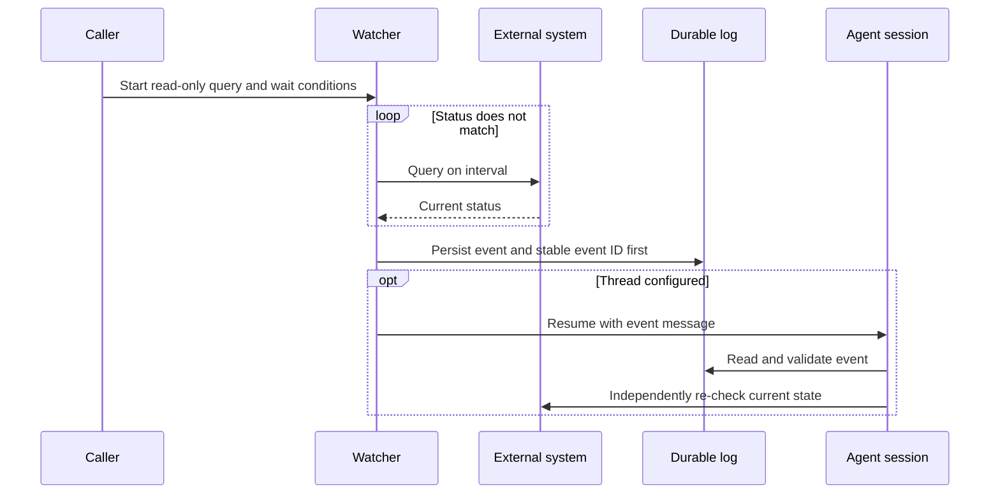

# `$wait`: Passive waiting for external state

English | [简体中文](wait.zh-CN.md)

`wait` is the primary skill. It moves repeated state queries into `scripts/wait_for.py`; the model does not poll while the watcher waits. The watcher resumes the owning session only when the state becomes ready or terminal, the wait times out, or repeated queries fail. See [client adapters](clients.md) for invocation and resume commands.

## Execution overview



While state is unchanged, only the regular Python process runs. Without `--session`, the watcher writes its log and exits for the caller to inspect.

## Query contract

The query must be read-only and print one short status value. Everything after `--` is executed directly by the watcher without an implicit shell. Query stdout is capped at 64 KiB and stderr is discarded.

```bash
python scripts/wait_for.py \
  --label "deployment api" \
  --ready Ready \
  --terminal Failed \
  --interval 60 \
  --timeout 3600 \
  --client codex \
  --session "$AGENT_SESSION_ID" \
  --lock-file /tmp/wait-deployment-api.lock \
  --log-file /tmp/wait-deployment-api.json \
  --message-template '$wait resume /tmp/wait-deployment-api.json; event_id={event_id}; event={event}; status={status}. Re-check external state before acting.' \
  -- deployctl status api --output status
```

JSON objects and arrays require an option such as `--json-path status` for `{"status":"ServiceReady"}` or `--json-path run.status` for a nested field. Without it, the watcher immediately emits `query_failed` with a safe configuration error instead of retrying an invalid contract.

Every watcher has a finite overall limit; `--timeout` defaults to 24 hours. The default query interval is five minutes and the positive consecutive-failure limit defaults to 12. Neither safeguard can be disabled.
Each notification or session-resume attempt is bounded by `--notification-timeout`. Retry defaults differ by client because queue failures and synchronous session-resume timeouts have different duplicate-delivery risks; see [client adapters](clients.md).

## Execution protocol

1. **Define conditions.** `--ready` and `--terminal` use exact, disjoint string matches. The read-only query should emit one short scalar; use `--json-path` for JSON.
2. **Acquire ownership.** The watcher takes `--lock-file` without blocking. A second watcher returns `already_watching` and does not start another query loop.
3. **Query.** Each call is bounded by `--query-timeout` and any remaining overall timeout. A successful query resets the consecutive-failure count.
4. **Persist.** On ready, terminal, overall timeout, or repeated query failure, the watcher chooses a stable `event_id`: standalone `$wait` generates one, while `wait-loop` and `wait-goal` integrations reuse their `watch_id`. It writes the result atomically before notification.
5. **Notify.** The selected client adapter resumes the saved session with the stable event ID. Delivery progress is persisted first. Codex queue failures retry by default; synchronous CLI adapters default to one attempt because a timeout may already have started a turn. Before every retry, a goal-owned watcher confirms that its watch is still active.
6. **Resume and verify.** A resume message is only a hint. The receiver validates the log and event ID, then independently queries the external system once before deciding what to do.

| Result or condition | Trigger | Exit | Receiver action |
| --- | --- | ---: | --- |
| `ready` | Status matches `--ready` | `0` | Re-query, then decide whether to complete |
| `terminal` | Status matches `--terminal` | `2` | Re-query, then decide whether to fail or escalate |
| `query_failed` | Consecutive failure limit reached | `3` | Diagnose the query; do not infer external state |
| `timeout` | Overall wait expired | `124` | Re-query, then continue or stop |
| `already_watching` | Lock is held | `75` | Keep the existing watcher |
| Ownership or activation cancelled | Loop ownership was lost, or a goal wait became invalid or was not activated in time | `76` | Re-read the owning state |
| `interrupted` | Watcher interrupted | `130` | Inspect log and goal state |
| Notification failure | Configured retry limit exhausted | `70` | Read the persisted log and decide whether to redeliver |

When an explicitly invoked `wait-goal` uses the watcher, startup adds a two-phase handshake. The watcher acquires the lock and writes a `watcher_started` receipt without querying. The root validates the node, watch ID, client, target session, log, receipt age, and live lock before running `activate-wait`. Only then does querying begin. A prepared watcher exits after `--activation-timeout`; an active watcher exits before its next query or notification retry if the saved wait is cancelled, replaced, missing, or invalid. Use `wait_goal.py abort-wait` with the exact watch ID before replacing an orphaned watcher.

## Run in the background

Use a process manager that the current environment supports reliably for long waits. Prefer `tmux` after confirming it is installed. Select a resume adapter with `--client` and identify the owning conversation with `--session`; `--remote` applies only to Codex.

Use a unique lock file for each external object and session. When `--session` is set, `--lock-file`, `--log-file`, and an explicit `--message-template` are required. The template contains exactly one resume directive and includes `{event_id}`, `{event}`, and `{status}`. A standalone `wait` template binds the exact log path; a loop template binds its state and watcher log; a goal template also binds one node. Use `--max-notification-attempts` to override the adapter's retry default.

## Integrate with `$wait-goal`

First prepare the external wait; the node remains `running` until activation:

```bash
GOAL_STATE=/tmp/.wait-goal/PROJECT/GOAL.json # state_file returned by init

python scripts/wait_goal.py wait \
  --state "$GOAL_STATE" \
  --id deploy \
  --label "deployment api" \
  --log-file /tmp/wait-deployment-api.json \
  --lock-file /tmp/wait-deployment-api.lock \
  --startup-file /tmp/wait-deployment-api.started.json
```

This command returns the new `watch_id` together with absolute state, log, lock, and startup paths. Use those returned values when starting the watcher so process-manager working directories cannot change their meaning.

Then start the watcher. Its message template must invoke the skill explicitly and include the state file, node, and watcher log:

```bash
python scripts/wait_for.py \
  --label "deployment api" \
  --ready Ready \
  --terminal Failed \
  --timeout 3600 \
  --client codex \
  --session "$AGENT_SESSION_ID" \
  --lock-file /tmp/wait-deployment-api.lock \
  --log-file /tmp/wait-deployment-api.json \
  --event-id WATCH_ID_FROM_WAIT_OUTPUT \
  --goal-state "$GOAL_STATE" \
  --goal-node deploy \
  --startup-file /tmp/wait-deployment-api.started.json \
  --message-template "\$wait-goal resume $GOAL_STATE; node=deploy; watcher_log=/tmp/wait-deployment-api.json; event_id={event_id}; event={event}; status={status}. Re-check external state before acting." \
  -- deployctl status api --output status
```

The watcher first writes the startup receipt and waits without querying. After confirming that receipt, activate the prepared wait:

```bash
python scripts/wait_goal.py activate-wait \
  --state "$GOAL_STATE" \
  --id deploy \
  --watch-id WATCH_ID_FROM_WAIT_OUTPUT
```

After wake-up, read the watcher log and record the event:

```bash
python scripts/wait_goal.py wake \
  --state "$GOAL_STATE" \
  --id deploy \
  --event-id WATCH_ID_FROM_LOG \
  --event ready \
  --external-status Ready
```

Every watcher event returns the node to `running`; it does not complete or fail the node. The root must query the current external state once more, then explicitly run `complete`, `fail`, or prepare another wait. The event ID must equal the active `watch_id`; stale events are rejected. Replaying the current event is a safe no-op, while reusing its ID with different data is rejected.

```mermaid
sequenceDiagram
    autonumber
    participant A as Root agent
    participant G as Goal state file
    participant W as wait_for.py
    participant E as External system
    participant C as Agent session

    A->>G: wait: prepare watch ID; node stays running
    A->>W: Start background watcher
    W-->>A: Write startup receipt; wait for activation
    A->>G: activate-wait: move node to waiting
    A-->>A: End the model turn

    loop Until ready, terminal, timeout, or query_failed
        W->>E: Run read-only status query
        E-->>W: Return short status
    end

    W->>W: Write event and delivery state
    W->>C: Resume session with the stable event ID
    C->>A: Resume the goal
    A->>G: Read state and run wake
    A->>W: Read watcher log
    A->>E: Re-check current state once
    E-->>A: Return current state

    alt Verified ready
        A->>G: complete
    else Verified terminal or unrecoverable
        A->>G: fail explicitly
    else Still waiting
        A->>G: prepare the next wait cycle
        A->>W: Start and activate a new watcher
    end
```

## Security constraints

- Keep credentials in environment variables or configuration files, not argv, state files, logs, or messages.
- Raw query stdout and stderr are not forwarded. Only a bounded short status can enter the result and notification.
- A wake-up message does not authorize retries, rebuilds, deployments, or other external mutations.
- If pipes, redirection, or other shell syntax is required, invoke `bash -lc` explicitly and review quoting and credential exposure risks.
