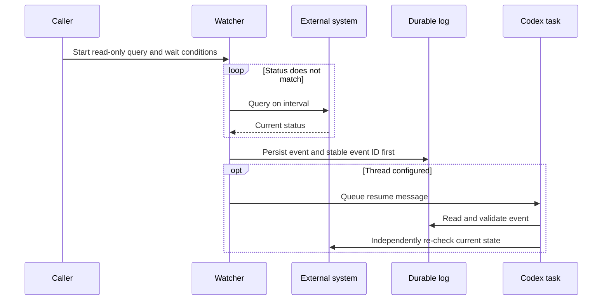

# `$wait`: Passive waiting for external state

English | [简体中文](wait.zh-CN.md)

`$wait` uses `scripts/wait_for.py` to move repeated state queries into a regular Python process. The model does not actively poll while waiting; the watcher queues an event with a unique ID when the state becomes ready or terminal, the wait times out, or repeated queries fail.

## Execution overview



While state is unchanged, only the regular Python process runs; the model does not participate. Without `--thread`, the watcher writes its log and exits for the caller to inspect.

## Query contract

The query must be read-only and print one short status value. Everything after `--` is executed directly by the watcher without an implicit shell. Query stdout is capped at 64 KiB and stderr is discarded.

```bash
python scripts/wait_for.py \
  --label "deployment api" \
  --ready Ready \
  --terminal Failed \
  --interval 60 \
  --thread "$CODEX_THREAD_ID" \
  --lock-file /tmp/wait-deployment-api.lock \
  --log-file /tmp/wait-deployment-api.json \
  --message-template '$wait resume /tmp/wait-deployment-api.json; event_id={event_id}; event={event}; status={status}. Re-check external state before acting.' \
  -- deployctl status api --output status
```

For JSON output, add an option such as `--json-path run.status` to select one scalar field.

Omit `--timeout` to wait indefinitely. The default query interval is five minutes and the default consecutive-failure limit is 12. Use `--max-consecutive-failures 0` to disable that limit.
Codex queue delivery is bounded by `--notification-timeout` (60 seconds by default).

## Execution protocol

1. **Define conditions.** `--ready` and `--terminal` use exact, disjoint string matches. The read-only query should emit one short scalar; use `--json-path` for JSON.
2. **Acquire ownership.** The watcher takes `--lock-file` without blocking. A second watcher returns `already_watching` and does not start another query loop.
3. **Query.** Each call is bounded by `--query-timeout` and any remaining overall timeout. A successful query resets the consecutive-failure count.
4. **Persist.** On ready, terminal, overall timeout, or repeated query failure, the watcher chooses a stable `event_id`: standalone `$wait` generates one, while `$wait-goal` integration reuses its `watch_id`. It writes the result atomically before notification.
5. **Notify.** Each queue attempt is bounded by `--notification-timeout`. Definite failures and timed-out attempts retry with exponential backoff and the same ID. Duplicate messages are safe because the receiver deduplicates that stable ID. Before every retry, a goal-integrated watcher confirms that its watch is still active. Delivery progress is persisted first.
6. **Resume and verify.** A resume message is only a hint. The receiver validates the log and event ID, then independently queries the external system once before deciding what to do.

| Result or condition | Trigger | Exit | Receiver action |
| --- | --- | ---: | --- |
| `ready` | Status matches `--ready` | `0` | Re-query, then decide whether to complete |
| `terminal` | Status matches `--terminal` | `2` | Re-query, then decide whether to fail or escalate |
| `query_failed` | Consecutive failure limit reached | `3` | Diagnose the query; do not infer external state |
| `timeout` | Overall wait expired | `124` | Re-query, then continue or stop |
| `already_watching` | Lock is held | `75` | Keep the existing watcher |
| Activation cancelled | Goal wait became invalid, or was not activated within `--activation-timeout` | `76` | Re-read goal state |
| `interrupted` | Watcher interrupted | `130` | Inspect log and goal state |
| Notification failure | Configured retry limit exhausted | `70` | Read the persisted log and decide whether to redeliver |

With `$wait-goal`, startup uses a two-phase handshake. The watcher first acquires the lock and writes a `watcher_started` receipt without querying. The root validates the node, watch ID, target thread, log, unexpired receipt, and live watcher lock before running `activate-wait`. Only after observing that exact active wait does the watcher begin querying. A prepared watcher exits after `--activation-timeout` (60 seconds by default), and an active watcher exits before its next query or notification retry if the saved wait is cancelled, replaced, missing, or invalid. Use `wait_goal.py abort-wait` with the exact watch ID to recover an orphaned prepared or active wait before starting a replacement.

## Run in the background

Use a process manager that the current environment supports reliably for long waits. Prefer `tmux` after confirming it is installed. The watcher connects to the existing Codex App Server using `--remote` and `--thread`; the default endpoint is `unix://`.

Use a unique lock file for each external object and Codex task. When `--thread` is set, `--lock-file`, `--log-file`, and an explicit `--message-template` are required. The template must contain exactly one resume directive. A standalone template binds the exact log path as `$wait resume <log path>`; a goal-integrated template binds it once as `watcher_log=<log path>` and binds one goal node. The template must also contain `{event_id}`, `{event}`, and `{status}`. Use `--max-notification-attempts` to limit retries after delivery failures or timeouts.

## Integrate with `$wait-goal`

First prepare the external wait; the node remains `running` until activation:

```bash
python scripts/wait_goal.py wait \
  --state .wait-goal/release.json \
  --id deploy \
  --label "deployment api" \
  --log-file /tmp/wait-deployment-api.json \
  --lock-file /tmp/wait-deployment-api.lock \
  --startup-file /tmp/wait-deployment-api.started.json
```

This command returns the new `watch_id` together with absolute state, log, lock, and startup paths. Use those returned values when starting the watcher so process-manager working directories cannot change their meaning.

Then start the watcher. Its message template must invoke the skill explicitly and include the state file, node, and watcher log:

```bash
python scripts/wait_for.py \
  --label "deployment api" \
  --ready Ready \
  --terminal Failed \
  --thread "$CODEX_THREAD_ID" \
  --lock-file /tmp/wait-deployment-api.lock \
  --log-file /tmp/wait-deployment-api.json \
  --event-id WATCH_ID_FROM_WAIT_OUTPUT \
  --goal-state /absolute/path/to/.wait-goal/release.json \
  --goal-node deploy \
  --startup-file /tmp/wait-deployment-api.started.json \
  --message-template '$wait-goal resume /absolute/path/to/.wait-goal/release.json; node=deploy; watcher_log=/tmp/wait-deployment-api.json; event_id={event_id}; event={event}; status={status}. Re-check external state before acting.' \
  -- deployctl status api --output status
```

The watcher first writes the startup receipt and waits without querying. After confirming that receipt, activate the prepared wait:

```bash
python scripts/wait_goal.py activate-wait \
  --state .wait-goal/release.json \
  --id deploy \
  --watch-id WATCH_ID_FROM_WAIT_OUTPUT
```

After wake-up, read the watcher log and record the event:

```bash
python scripts/wait_goal.py wake \
  --state .wait-goal/release.json \
  --id deploy \
  --event-id WATCH_ID_FROM_LOG \
  --event ready \
  --external-status Ready
```

Every watcher event returns the node to `running`; it does not complete or fail the node. Codex must query the current external state once more, then explicitly run `complete`, `fail`, or prepare another wait. The event ID must equal the active `watch_id`; stale events from older wait cycles are rejected. Replaying the current event is a safe no-op, while reusing its ID with different data is rejected.

```mermaid
sequenceDiagram
    autonumber
    participant A as Root agent
    participant G as Goal state file
    participant W as wait_for.py
    participant E as External system
    participant C as Codex task

    A->>G: wait: prepare watch ID; node stays running
    A->>W: Start background watcher
    W-->>A: Write startup receipt; wait for activation
    A->>G: activate-wait: move node to waiting
    A-->>A: End the model turn

    loop Until ready, terminal, timeout, or query_failed
        W->>E: Run read-only status query
        E-->>W: Return short status
    end

    W->>W: Write event and delivery state
    W->>C: Queue resume; retry definite failures with the stable ID
    C->>A: Resume the goal
    A->>G: Read state and run wake
    A->>W: Read watcher log
    A->>E: Re-check current state once
    E-->>A: Return current state

    alt Verified ready
        A->>G: complete
    else Verified terminal or unrecoverable
        A->>G: fail explicitly
    else Still waiting
        A->>G: prepare the next wait cycle
        A->>W: Start and activate a new watcher
    end
```

## Security constraints

- Keep credentials in environment variables or configuration files, not argv, state files, logs, or messages.
- Raw query stdout and stderr are not forwarded. Only a bounded short status can enter the result and notification.
- A wake-up message does not authorize retries, rebuilds, deployments, or other external mutations.
- If pipes, redirection, or other shell syntax is required, invoke `bash -lc` explicitly and review quoting and credential exposure risks.
