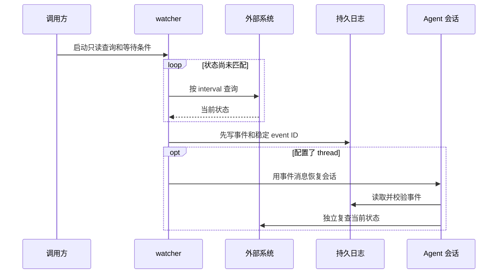

# `$wait`：被动等待外部状态

[English](wait.md) | 简体中文

`wait` 是主 Skill。它把重复状态查询移到 `scripts/wait_for.py`，等待期间模型不参与轮询；只有状态就绪、进入终止状态、超时或连续查询失败时，watcher 才用唯一事件 ID 恢复所属会话。调用和恢复命令见[客户端适配](clients.zh-CN.md)。

## 运行流程总览



状态未变化时只有普通 Python 进程运行。未配置 `--session` 时，watcher 写入日志并退出，由调用方读取结果。

## 查询约定

查询命令必须是只读命令，并输出一个短状态值。命令位于 `--` 之后，由监视器直接执行，不会隐式调用 shell。查询 stdout 上限为 64 KiB，stderr 会被丢弃。

```bash
python scripts/wait_for.py \
  --label "deployment api" \
  --ready Ready \
  --terminal Failed \
  --interval 60 \
  --timeout 3600 \
  --client codex \
  --session "$AGENT_SESSION_ID" \
  --lock-file /tmp/wait-deployment-api.lock \
  --log-file /tmp/wait-deployment-api.json \
  --message-template '$wait resume /tmp/wait-deployment-api.json; event_id={event_id}; event={event}; status={status}. 恢复后先重新检查外部状态。' \
  -- deployctl status api --output status
```

JSON 对象或数组必须选择一个标量字段，例如 `{"status":"ServiceReady"}` 使用 `--json-path status`，嵌套字段可使用 `--json-path run.status`；否则 watcher 会立即产生带安全配置错误的 `query_failed`，不会反复重试无效约定。

每个 watcher 都有有限的总时长，`--timeout` 默认为 24 小时。默认查询间隔为五分钟；连续失败上限必须为正数，默认为 12。两项保护都不能关闭。
每次通知或会话恢复受 `--notification-timeout` 限制。队列失败与同步恢复超时的重复投递风险不同，因此默认重试策略按客户端区分，详见[客户端适配](clients.zh-CN.md)。

## 执行协议

一次 `$wait` 由发送方、watcher、外部系统和接收方共同完成：

1. **发送方定义条件。** `--ready` 和 `--terminal` 使用精确字符串匹配且不能重叠。查询命令必须只读，并且只输出一个短标量状态；JSON 输出通过 `--json-path` 提取。
2. **watcher 取得所有权。** 它以非阻塞方式取得 `--lock-file`。已有进程持有同一 lock 时，新 watcher 返回 `already_watching`，不会启动第二个查询循环。
3. **watcher 执行查询循环。** 每次查询最多运行 `--query-timeout` 秒；设置总 `--timeout` 时，单次查询也不会越过剩余总时间。普通状态按 `--interval` 继续等待，成功查询会清零连续失败计数。
4. **watcher 固化事件。** 遇到 ready、terminal、总超时或连续查询失败后，确定稳定的 `event_id`：独立 `$wait` 生成新 ID，与 `wait-loop` 或 `wait-goal` 集成时沿用其 `watch_id`。结果先原子写入 `--log-file`，再尝试通知。
5. **watcher 投递通知。** 客户端适配器使用稳定 event ID 恢复已保存的会话，并先持久化投递进度。Codex 队列失败默认重试；同步 CLI 适配器默认只尝试一次，因为超时可能已经启动了模型轮次。goal watcher 每次重试前还会确认当前 watch 仍有效。
6. **watcher 完成交接。** goal 通知成功后，watcher 会继续持有 lock，直到根 Agent 记录 `wake`，最长不超过 `--wake-ack-timeout`。这样能区分正常的“通知已送达、wake 尚未落盘”窗口与 watcher 消失。
7. **接收方恢复并复查。** 恢复消息只是提示。接收方先读取日志并校验 event ID，再对外部系统执行一次独立的只读查询；只有复查结果可以驱动后续完成或失败判断。

事件和退出状态如下：

| 结果或情形 | 触发条件 | 退出码 | 接收方动作 |
| --- | --- | ---: | --- |
| `ready` | 状态精确匹配任一 `--ready` | `0` | 重新查询后决定完成 |
| `terminal` | 状态精确匹配任一 `--terminal` | `2` | 重新查询后决定失败或请求处理 |
| `query_failed` | 达到连续查询失败上限 | `3` | 检查查询能力，不推断外部状态 |
| `timeout` | 超过总等待时间 | `124` | 重新查询后决定继续等待或停止 |
| `already_watching` | lock 已被占用 | `75` | 沿用现有 watcher |
| ownership 或 activation cancelled | loop 所有权丢失，或 goal wait 失效、未按时激活 | `76` | 不通知，重新读取所属状态 |
| `interrupted` | watcher 被中断 | `130` | 检查日志和目标状态 |
| 通知失败 | 已配置的重试次数耗尽 | `70` | 读取已持久化日志，人工决定是否补投 |

用户明确调用的 `wait-goal` 使用 watcher 时，会增加两阶段握手：watcher 先取得 lock 并写 `watcher_started` 回执，但不查询；根 Agent 校验 node、watch ID、client、目标 session、日志、回执时效和仍被持有的 lock，再执行 `activate-wait`。prepared watcher 超过 `--activation-timeout` 未激活会退出；active wait 被取消、替换、删除或损坏后，也会在下一次查询或通知重试前退出。通知成功后，它继续持有 lock，最长不超过 `--wake-ack-timeout`，并在 `wake` 改变节点状态后立即释放。替换孤儿 watcher 前，先用准确 watch ID 执行 `abort-wait`。

## 后台运行

长时间等待使用当前环境可靠支持的进程管理方式；确认安装后可优先使用 `tmux`。通过 `--client` 选择恢复适配器，以 `--session` 指定所属会话；`--remote` 仅供 Codex 使用。

为每个外部对象和会话使用唯一 lock。设置 `--session` 时必须同时提供 `--lock-file`、`--log-file` 和显式 `--message-template`。模板必须且只能包含一条恢复指令，并包含 `{event_id}`、`{event}` 和 `{status}`。独立 `wait` 模板绑定准确日志路径；loop 模板绑定状态和 watcher 日志；goal 模板还绑定唯一节点。`--max-notification-attempts` 可覆盖适配器默认重试次数。

## 与 `$wait-goal` 集成

先准备 external wait；激活前节点仍保持 `running`：

```bash
GOAL_STATE=/tmp/.wait-goal/PROJECT/GOAL.json # init 返回的 state_file

python scripts/wait_goal.py wait \
  --state "$GOAL_STATE" \
  --id deploy \
  --label "deployment api" \
  --log-file /tmp/wait-deployment-api.json \
  --lock-file /tmp/wait-deployment-api.lock \
  --startup-file /tmp/wait-deployment-api.started.json
```

该命令会返回新的 `watch_id`，以及 state、log、lock、startup 的绝对路径。启动 watcher 时使用这些返回值，避免进程管理器工作目录不同而改变路径含义。

随后启动 watcher。消息模板必须显式重新调用技能，并包含 state、node 和 watcher log：

```bash
python scripts/wait_for.py \
  --label "deployment api" \
  --ready Ready \
  --terminal Failed \
  --timeout 3600 \
  --client codex \
  --session "$AGENT_SESSION_ID" \
  --lock-file /tmp/wait-deployment-api.lock \
  --log-file /tmp/wait-deployment-api.json \
  --event-id WATCH_ID_FROM_WAIT_OUTPUT \
  --goal-state "$GOAL_STATE" \
  --goal-node deploy \
  --startup-file /tmp/wait-deployment-api.started.json \
  --message-template "\$wait-goal resume $GOAL_STATE; node=deploy; watcher_log=/tmp/wait-deployment-api.json; event_id={event_id}; event={event}; status={status}. 恢复后先重新检查外部状态。" \
  -- deployctl status api --output status
```

watcher 会先写入启动回执，并在不查询外部状态的情况下等待。确认回执后激活本轮等待：

```bash
python scripts/wait_goal.py activate-wait \
  --state "$GOAL_STATE" \
  --id deploy \
  --watch-id WATCH_ID_FROM_WAIT_OUTPUT
```

唤醒后读取 watcher log，并记录事件：

```bash
python scripts/wait_goal.py wake \
  --state "$GOAL_STATE" \
  --id deploy \
  --event-id WATCH_ID_FROM_LOG \
  --event ready \
  --external-status Ready
```

所有 watcher 事件都只会把节点恢复为 `running`，不会直接完成或判定失败。根 Agent 必须重新查询一次当前外部状态，再明确执行 `complete`、`fail` 或准备下一轮等待。event ID 必须等于当前活动的 `watch_id`；旧事件会被拒绝。重复提交当前事件是安全空操作，使用相同 ID 提交不同数据会被拒绝。


## 安全约束

- 凭据应放在环境变量或配置文件中，不要写入 argv、状态文件、日志或消息。
- 原始查询 stdout 和 stderr 不会被转发；只有经过限制的短状态可以进入结果和通知。
- 唤醒消息不授予重试、重建、部署或修改外部系统的权限。
- 若必须使用管道、重定向等 shell 语法，应明确调用 `bash -lc`，并重新检查引用和凭据风险。
