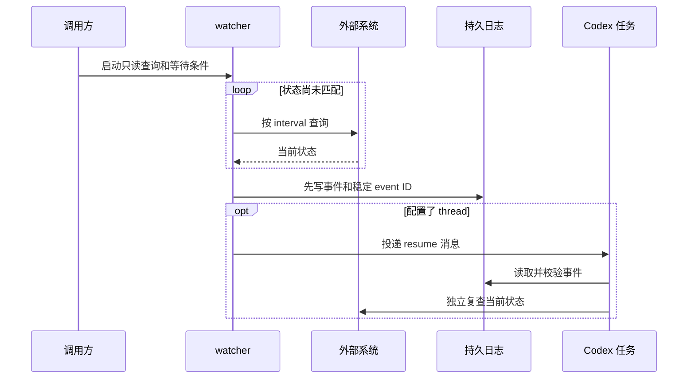
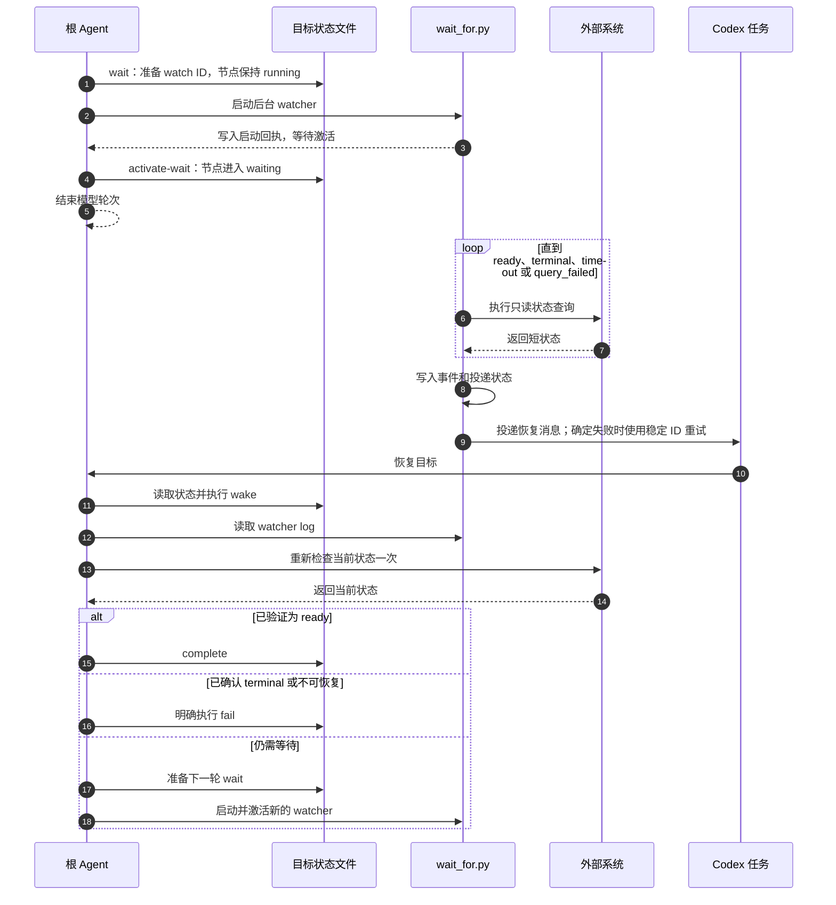

# `$wait`：被动等待外部状态

[English](wait.md) | 简体中文

`$wait` 使用 `scripts/wait_for.py` 将重复状态查询移到普通 Python 进程中。等待期间不需要模型主动轮询；只有状态就绪、进入终止状态、超时或连续查询失败时，监视器才向现有 Codex 任务投递带唯一 ID 的事件。

## 运行流程总览



状态未变化时只有普通 Python 进程运行；模型不参与循环。未配置 `--thread` 时，watcher 写入日志并退出，由调用方读取结果。

## 查询约定

查询命令必须是只读命令，并输出一个短状态值。命令位于 `--` 之后，由监视器直接执行，不会隐式调用 shell。查询 stdout 上限为 64 KiB，stderr 会被丢弃。

```bash
python scripts/wait_for.py \
  --label "deployment api" \
  --ready Ready \
  --terminal Failed \
  --interval 60 \
  --thread "$CODEX_THREAD_ID" \
  --lock-file /tmp/wait-deployment-api.lock \
  --log-file /tmp/wait-deployment-api.json \
  --message-template '$wait resume /tmp/wait-deployment-api.json; event_id={event_id}; event={event}; status={status}. 恢复后先重新检查外部状态。' \
  -- deployctl status api --output status
```

如果命令输出 JSON，增加 `--json-path run.status` 之类的参数，从 JSON 中选择一个标量字段。

省略 `--timeout` 表示无限等待。默认查询间隔为五分钟；默认连续失败上限为 12，使用 `--max-consecutive-failures 0` 可关闭该上限。
Codex queue 单次投递受 `--notification-timeout` 限制，默认 60 秒。

## 执行协议

一次 `$wait` 由发送方、watcher、外部系统和接收方共同完成：

1. **发送方定义条件。** `--ready` 和 `--terminal` 使用精确字符串匹配且不能重叠。查询命令必须只读，并且只输出一个短标量状态；JSON 输出通过 `--json-path` 提取。
2. **watcher 取得所有权。** 它以非阻塞方式取得 `--lock-file`。已有进程持有同一 lock 时，新 watcher 返回 `already_watching`，不会启动第二个查询循环。
3. **watcher 执行查询循环。** 每次查询最多运行 `--query-timeout` 秒；设置总 `--timeout` 时，单次查询也不会越过剩余总时间。普通状态按 `--interval` 继续等待，成功查询会清零连续失败计数。
4. **watcher 固化事件。** 遇到 ready、terminal、总超时或连续查询失败后，确定稳定的 `event_id`：独立 `$wait` 生成新 ID，与 `$wait-goal` 集成时沿用 `watch_id`。结果先原子写入 `--log-file`，再尝试通知。
5. **watcher 投递通知。** 每次 queue 调用最多运行 `--notification-timeout` 秒。明确失败和调用超时都会使用同一 ID 指数退避重试；接收方依据该稳定 ID 去重，因此重复消息是安全的。与 goal 集成时，每次重试前还会确认当前 watch 仍然有效。每次投递状态变化都会先写回日志。
6. **接收方恢复并复查。** 恢复消息只是提示。接收方先读取日志并校验 event ID，再对外部系统执行一次独立的只读查询；只有复查结果可以驱动后续完成或失败判断。

事件和退出状态如下：

| 结果或情形 | 触发条件 | 退出码 | 接收方动作 |
| --- | --- | ---: | --- |
| `ready` | 状态精确匹配任一 `--ready` | `0` | 重新查询后决定完成 |
| `terminal` | 状态精确匹配任一 `--terminal` | `2` | 重新查询后决定失败或请求处理 |
| `query_failed` | 达到连续查询失败上限 | `3` | 检查查询能力，不推断外部状态 |
| `timeout` | 超过总等待时间 | `124` | 重新查询后决定继续等待或停止 |
| `already_watching` | lock 已被占用 | `75` | 沿用现有 watcher |
| activation cancelled | goal wait 失效，或未在 `--activation-timeout` 内激活 | `76` | 不通知，重新读取目标状态 |
| `interrupted` | watcher 被中断 | `130` | 检查日志和目标状态 |
| 通知失败 | 已配置的重试次数耗尽 | `70` | 读取已持久化日志，人工决定是否补投 |

与 `$wait-goal` 集成时还有一个两阶段握手：watcher 先取得 lock 并写 `watcher_started` 回执，但不查询；根 Agent 校验回执中的 node、watch ID、目标 thread、日志、未过期时间和仍被持有的 watcher lock 后执行 `activate-wait`；watcher 观察到完全一致的 active wait 才进入查询循环。prepared watcher 若未在 `--activation-timeout` 内激活会退出，默认期限为 60 秒；active wait 被取消、替换、删除或损坏后，watcher 会在下一次查询或通知重试前退出。需要恢复孤儿 prepared 或 active wait 时，先使用准确的 watch ID 执行 `wait_goal.py abort-wait`，再启动替代 watcher。

## 后台运行

长时间等待必须使用当前环境可靠支持的进程管理方式。确认安装后优先使用 `tmux`。监视器需要通过 `--remote` 和 `--thread` 连接现有 Codex App Server；默认 endpoint 为 `unix://`。

为每个外部对象和 Codex 任务使用唯一的 lock 文件。设置 `--thread` 时必须同时提供 `--lock-file`、`--log-file` 和显式 `--message-template`。模板必须且只能包含一条恢复指令：独立 `$wait` 用 `$wait resume <日志路径>` 精确绑定日志；接入 goal 的模板只绑定一次 `watcher_log=<日志路径>` 和一个目标节点。模板还必须包含 `{event_id}`、`{event}` 和 `{status}`。`--max-notification-attempts` 可限制投递失败或超时后的重试次数。

## 与 `$wait-goal` 集成

先准备 external wait；激活前节点仍保持 `running`：

```bash
python scripts/wait_goal.py wait \
  --state .wait-goal/release.json \
  --id deploy \
  --label "deployment api" \
  --log-file /tmp/wait-deployment-api.json \
  --lock-file /tmp/wait-deployment-api.lock \
  --startup-file /tmp/wait-deployment-api.started.json
```

该命令会返回新的 `watch_id`，以及 state、log、lock、startup 的绝对路径。启动 watcher 时使用这些返回值，避免进程管理器工作目录不同而改变路径含义。

随后启动 watcher。消息模板必须显式重新调用技能，并包含 state、node 和 watcher log：

```bash
python scripts/wait_for.py \
  --label "deployment api" \
  --ready Ready \
  --terminal Failed \
  --thread "$CODEX_THREAD_ID" \
  --lock-file /tmp/wait-deployment-api.lock \
  --log-file /tmp/wait-deployment-api.json \
  --event-id WATCH_ID_FROM_WAIT_OUTPUT \
  --goal-state /absolute/path/to/.wait-goal/release.json \
  --goal-node deploy \
  --startup-file /tmp/wait-deployment-api.started.json \
  --message-template '$wait-goal resume /absolute/path/to/.wait-goal/release.json; node=deploy; watcher_log=/tmp/wait-deployment-api.json; event_id={event_id}; event={event}; status={status}. Re-check external state before acting.' \
  -- deployctl status api --output status
```

watcher 会先写入启动回执，并在不查询外部状态的情况下等待。确认回执后激活本轮等待：

```bash
python scripts/wait_goal.py activate-wait \
  --state .wait-goal/release.json \
  --id deploy \
  --watch-id WATCH_ID_FROM_WAIT_OUTPUT
```

唤醒后读取 watcher log，并记录事件：

```bash
python scripts/wait_goal.py wake \
  --state .wait-goal/release.json \
  --id deploy \
  --event-id WATCH_ID_FROM_LOG \
  --event ready \
  --external-status Ready
```

所有 watcher 事件都只会把节点恢复为 `running`，不会直接完成或判定失败。Codex 必须重新查询一次当前外部状态，再明确执行 `complete`、`fail` 或准备下一轮等待。event ID 必须等于当前活动的 `watch_id`，旧等待轮次的事件会被拒绝。重复提交当前事件是安全的空操作；使用相同 ID 提交不同数据会被拒绝。



## 安全约束

- 凭据应放在环境变量或配置文件中，不要写入 argv、状态文件、日志或消息。
- 原始查询 stdout 和 stderr 不会被转发；只有经过限制的短状态可以进入结果和通知。
- 唤醒消息不授予重试、重建、部署或修改外部系统的权限。
- 若必须使用管道、重定向等 shell 语法，应明确调用 `bash -lc`，并重新检查引用和凭据风险。
